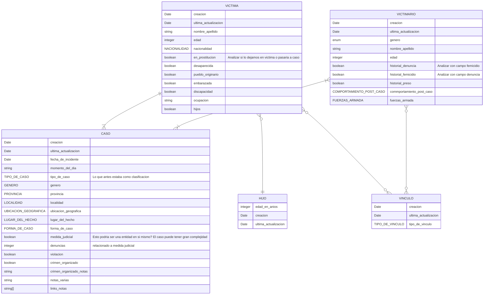

```mermaid
    erDiagram

    CASO {
        Date creacion
        Date ultima_actualizacion
        Date fecha_de_incidente
        string momento_del_dia
        TIPO_DE_CASO tipo_de_caso "Lo que antes estaba como clasificacion"
        GENERO genero
        PROVINCIA provincia
        LOCALIDAD localidad
        UBICACION_GEOGRAFICA ubicacion_geografica
        LUGAR_DEL_HECHO lugar_del_hecho
        FORMA_DE_CASO forma_de_caso
        boolean medida_judicial "Esto podria ser una entidad en si mismo? El caso puede tener gran complejidad"
        integer denuncias "relacionado a medida judicial"
        boolean violacion
        boolean crimen_organizado
        string crimen_organizado_notas
        string notas_varias
        string[] links_notas
    }

    VICTIMA ||--|{ CASO : ""
    VICTIMARIO }|--|{ CASO : ""


    VICTIMA {
        Date creacion
        Date ultima_actualizacion
        string nombre_apellido
        integer edad
        NACIONALIDAD nacionalidad
        boolean en_prostitucion "Analizar si lo dejamos en victima o pasaria a caso"
        boolean desaparecida
        boolean pueblo_originario
        boolean embarazada
        boolean discapacidad
        string ocupacion
        boolean hijos


    }

    VICTIMA }o--|| HIJO : ""
    VICTIMA }o--o{ VINCULO : ""


    HIJO {
        integer edad_en_anios
        Date creacion
        Date ultima_actualizacion

    }


    VICTIMARIO {
        Date creacion
        Date ultima_actualizacion
        enum genero
        string nombre_apellido
        integer edad
        boolean historial_denuncia  "Analizar con campo femicidio"
        boolean historial_femicidio "Analizar con campo denuncia"
        boolean historial_preso
        COMPORTAMIENTO_POST_CASO commportamiento_post_caso
        FUERZAS_ARMADA fuerzas_armada

    }

    VICTIMARIO }o--o{ VINCULO : ""


    VINCULO {
        Date creacion
        Date ultima_actualizacion
        TIPO_DE_VINCULO tipo_de_vinculo

    }
```
